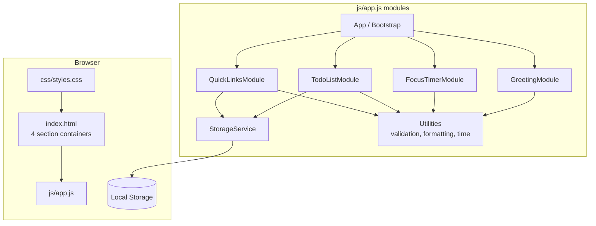
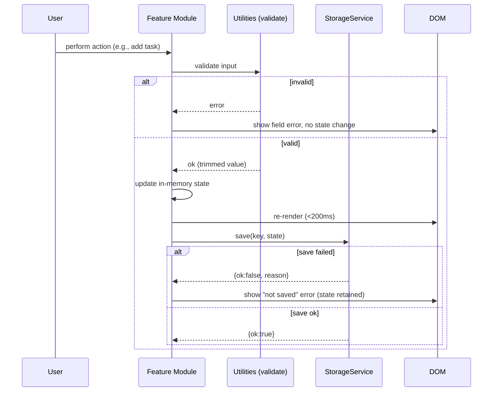

# Design Document

## Overview

The Todo List Life Dashboard is a client-side single-page web application that combines a personal productivity dashboard with a task manager. It renders four visually distinct, labeled sections — a time-based greeting, a 25-minute focus timer, a to-do list, and a set of quick links — on a single page. All user data persists to the browser via the Local Storage API. There is no backend server.

The application is built with three files following the required structure:

- `index.html` — page structure and the four section containers
- `css/styles.css` — all styling (single CSS file)
- `js/app.js` — all behavior (single Vanilla JavaScript file, no frameworks)

Because the constraint mandates a single JavaScript file, this design organizes the code into logical modules *within* that file using IIFE/namespace patterns (or ES module-style closures). Each module owns one concern and shares a thin, well-defined interface. This keeps the codebase simple, portable, and maintainable while honoring the single-file rule (Requirement 9.3).

### Design Goals

- Keep the four features loosely coupled so a change in one (for example, the timer) does not affect the others.
- Isolate all Local Storage access behind a single storage service so error handling (write failure, quota exceeded, unavailable/disabled, corrupt data) lives in one place (Requirements 7, 8.8, 9.4–9.6).
- Keep DOM rendering fast (under 200 ms per action, full render under 3 s) by rendering only what changed and avoiding heavy layout thrash (Requirements 10.3, 10.5).
- Favor pure functions for validation, formatting, and greeting selection so behavior is deterministic and testable.

### Key Design Decisions

| Decision | Rationale |
| --- | --- |
| Single JS file split into closures/namespaces | Satisfies Requirement 9.3 while keeping separation of concerns. |
| Central `StorageService` wrapping Local Storage | Concentrates all persistence error handling (9.4–9.6, 7.5, 8.8) in one place; the rest of the app treats persistence as a simple `load/save` that reports success or failure. |
| In-memory state is the source of truth; storage is a mirror | On a save failure the app keeps the in-memory change and surfaces an error, so the session stays usable (Requirements 3.6, 4.5, 5.5, 6.4, 9.5). |
| Stable unique `id` per Task and Quick_Link | Lets edit/complete/delete target a specific item safely, including "does not exist" cases (Requirements 5.6, 6.3). |
| Pure functions for validation, `MM:SS` formatting, and greeting selection | Deterministic, side-effect-free logic that is straightforward to verify and reuse. |
| `requestAnimationFrame`-independent timers via `setInterval` | Simple, adequate for 1 s timer ticks and 60 s clock updates. |

## Architecture

### High-Level Architecture



### Module Breakdown (within `js/app.js`)

The single JavaScript file is organized into the following logical modules. Each is an isolated closure exposing a small public interface.

1. **App / Bootstrap** — Entry point run on `DOMContentLoaded`. Detects Local Storage availability, performs a browser-support check, then initializes each feature module. Owns cross-cutting error banner display.
2. **StorageService** — The only code that touches `window.localStorage`. Exposes `isAvailable()`, `load(key)`, and `save(key, value)`. Serializes/deserializes JSON, classifies failures (unavailable, quota exceeded, write error, parse error), and returns a structured result rather than throwing.
3. **Utilities** — Pure helper functions shared across modules: text validation (trim + length bounds), URL validation (http/https, length), `MM:SS` formatting, and time-of-day greeting selection. No DOM or storage access.
4. **GreetingModule** — Renders current time (24-hour `HH:MM`), full date, and greeting; schedules periodic updates; handles unavailable time source.
5. **FocusTimerModule** — Owns countdown state and the start/stop/reset controls; ticks once per second; handles all timer edge cases.
6. **TodoListModule** — Owns the in-memory task list; handles add/edit/complete/delete; validates input; renders the list; delegates persistence to StorageService.
7. **QuickLinksModule** — Owns the in-memory quick-link set; handles add/open/delete; validates label and URL; enforces the 50-link cap; delegates persistence to StorageService.

### Data Flow: A User Action



The in-memory update and DOM render happen first so the interface reflects the change within 200 ms (Requirement 10.3); persistence follows and only surfaces an error on failure without rolling back the in-memory state (Requirements 3.6, 4.5, 5.5, 6.4).

## Components and Interfaces

### StorageService

Concentrates all Local Storage access and error classification.

```javascript
// Result shape returned by load/save
// { ok: true, value }                       // load success
// { ok: false, reason: 'unavailable'
//        | 'parse' | 'quota' | 'write' }    // failure classification

StorageService = {
  isAvailable(): boolean,                 // feature-detect Local Storage
  load(key): { ok, value?, reason? },     // parse JSON; 'parse' on corrupt data
  save(key, value): { ok, reason? }       // stringify + write; 'quota'/'write' on failure
}
```

- `isAvailable()` writes and removes a probe key inside a `try/catch` to detect disabled/unavailable storage (Requirement 9.6).
- `save()` catches exceptions and inspects them to distinguish `QuotaExceededError` from generic write errors (Requirements 9.5, 3.6, 4.5, 5.5, 6.4).
- `load()` returns `reason: 'parse'` when `JSON.parse` throws, enabling callers to fall back to empty state (Requirements 7.5, 8.8).

### GreetingModule

```javascript
GreetingModule = {
  init(rootEl): void,   // render immediately, then schedule updates
  render(now): void,    // render time/date/greeting for a given Date
  destroy(): void       // clear interval (for completeness)
}
```

- Renders `HH:MM` in 24-hour format and a full date (day, month, four-digit year) (Requirements 1.1, 1.2).
- Uses `setInterval` to refresh at least every 60 s, keeping displayed time within 60 s of actual and updating the greeting across boundary crossings (Requirements 1.3, 1.7). Interval chosen well under 60 s (for example, every 1 s or 15 s) to comfortably satisfy the tolerance.
- Greeting text derives from `Utilities.greetingForHour(hour)` (Requirements 1.4–1.6).
- If the time source is unavailable (constructing/reading a valid `Date` fails), displays a "time unavailable" indication and omits the greeting (Requirement 1.8).

### FocusTimerModule

```javascript
FocusTimerModule = {
  init(rootEl): void,
  start(): void,    // no-op if already running or remaining == 0
  stop(): void,     // no-op if not running
  reset(): void,    // stop and set remaining = 1500
  render(): void    // paint MM:SS from remainingSeconds
}
```

Internal state: `remainingSeconds` (integer, starts at 1500) and `intervalId` (or `null` when not running).

- Displays `25:00` on load (Requirement 2.1) and paints `MM:SS` from `remainingSeconds`.
- `start()` begins/continues counting down via `setInterval` at ~1000 ms, tolerance 100 ms (Requirements 2.2, 2.3). If already running, it is a no-op so the countdown is not disturbed (Requirement 2.7). If `remainingSeconds === 0`, it does not start (Requirement 2.9).
- `stop()` clears the interval and retains `remainingSeconds` (Requirement 2.4). If not running, it is a no-op (Requirement 2.8).
- `reset()` stops and sets `remainingSeconds = 1500`, displaying `25:00` (Requirement 2.5).
- On reaching `0`, stops the countdown and displays `00:00` (Requirement 2.6).

### TodoListModule

```javascript
TodoListModule = {
  init(rootEl): void,             // load from storage, render
  addTask(rawText): Result,       // validate, create, render, persist
  editTask(id, rawText): Result,  // validate, update, render, persist
  toggleTask(id): Result,         // flip done state, persist
  deleteTask(id): Result,         // remove, render, persist
  render(): void
}
```

Internal state: `tasks` (array of Task). Every mutation validates first, updates memory, renders, then persists.

- Add/edit trim text and enforce 1–500 characters; violations are rejected with a specific field error and no state change (Requirements 3.1, 3.4, 3.5, 4.1, 4.3, 4.4).
- Toggle sets/clears `done`; done tasks get a persistent visual style (Requirements 5.1–5.3).
- Toggle/delete against a non-existent `id` make no change (Requirements 5.6, 6.3).
- Delete removes only the targeted task (Requirement 6.1).
- On any successful mutation, persists within 1 s; on persistence failure keeps the in-memory change and shows a "not saved" error (Requirements 3.3, 3.6, 4.2, 4.5, 5.4, 5.5, 6.2, 6.4, 7.3).

### QuickLinksModule

```javascript
QuickLinksModule = {
  init(rootEl): void,           // load from storage, render
  addLink(label, url): Result,  // validate, cap-check, create, render, persist
  openLink(id): void,           // open URL in a new tab
  deleteLink(id): Result,       // remove, render, persist
  render(): void
}
```

Internal state: `links` (array of Quick_Link).

- Validates label (1–50 chars) and URL (http/https, 1–2048 chars); invalid input is rejected identifying the offending field (Requirements 8.1, 8.6).
- Enforces the 50-link cap, rejecting additions beyond it (Requirement 8.7).
- Opens the target URL in a new tab via `window.open(url, '_blank', 'noopener')` (Requirement 8.2).
- Delete removes the targeted link (Requirement 8.3); set changes persist to storage (Requirement 8.4).
- On load, restores from storage; unreadable/corrupt data falls back to an empty set without an unhandled error (Requirements 8.5, 8.8).

### App / Bootstrap

- Runs on `DOMContentLoaded`.
- Calls `StorageService.isAvailable()`. If unavailable, shows a persistent banner that data will not be persisted, then still initializes all modules so the session remains usable (Requirement 9.6).
- Performs a browser-support check (feature detection / version heuristic) and, if unsupported, shows an "unsupported browser" message while preserving access to any already-stored data (Requirement 10.6).
- Initializes each feature module.

## Data Models

### Task

Represents a single to-do item.

```javascript
Task = {
  id:   string,   // stable unique id (e.g., crypto.randomUUID() or timestamp+counter)
  text: string,   // trimmed, 1..500 characters
  done: boolean   // completion state
}
```

- `text` is always stored trimmed and within 1–500 characters (Requirements 3.1, 4.1).
- `done` defaults to `false` on creation (Requirement 3.1).
- `id` enables targeting a specific task for edit/toggle/delete and detecting non-existent targets (Requirements 5.6, 6.3).

### Quick_Link

Represents a single saved favorite site.

```javascript
QuickLink = {
  id:    string,   // stable unique id
  label: string,   // 1..50 characters
  url:   string    // http/https, 1..2048 characters
}
```

- `label` is 1–50 characters; `url` is a syntactically valid http or https URL, 1–2048 characters (Requirement 8.1).

### Local Storage Schema

All data is stored under namespaced string keys, each holding a JSON-serialized value.

| Key | Value | Notes |
| --- | --- | --- |
| `dashboard.tasks` | `Task[]` (JSON array) | Full task list; rewritten on every mutation (Requirement 7.3). |
| `dashboard.quickLinks` | `QuickLink[]` (JSON array) | Full quick-link set; rewritten on every change (Requirement 8.4). |

Notes:
- The Focus Timer and Greeting hold no persisted data — timer state resets to `25:00` on load (Requirement 2.1) and greeting derives from the system clock.
- Reading a missing key yields empty state (Requirements 7.4, 8.5). Reading a corrupt/unparsable value yields empty state plus a load-error indication for tasks and a silent empty fallback for quick links (Requirements 7.5, 8.8).
- Each save writes the entire array (full-collection persistence), which keeps the storage model simple and consistent with "persist the updated task list / set" language in the requirements.

## Correctness Properties

*A property is a characteristic or behavior that should hold true across all valid executions of a system — essentially, a formal statement about what the system should do. Properties serve as the bridge between human-readable specifications and machine-verifiable correctness guarantees.*

The properties below were derived from the acceptance criteria via the prework analysis and consolidated to remove redundancy. They target the pure, input-varying logic of the application: greeting selection, time/timer formatting, input validation, list/set operations, and serialization round-trips. Timing, persistence side effects, UI layout, cross-browser, and structural constraints are covered by unit/integration/manual checks in the Testing Strategy rather than as properties.

### Property 1: Time is formatted as 24-hour HH:MM

*For any* valid `Date`, the greeting time renderer produces a string of the form `HH:MM` where `HH` is `00`–`23` and `MM` is `00`–`59`, matching the date's local hour and minute.

**Validates: Requirements 1.1**

### Property 2: Date shows day, month, and four-digit year

*For any* valid `Date`, the greeting date renderer produces a string that includes the date's day, its month, and its four-digit year.

**Validates: Requirements 1.2**

### Property 3: Greeting selection is correct for every hour

*For any* hour `h` in `0`–`23`, `greetingForHour(h)` returns "Good morning" when `5 <= h <= 11`, "Good afternoon" when `12 <= h <= 17`, and "Good evening" when `h >= 18` or `h <= 4`. (This total-coverage property includes the boundary hours 5, 12, and 18 that drive the boundary-crossing update.)

**Validates: Requirements 1.4, 1.5, 1.6, 1.7**

### Property 4: MM:SS timer formatting round-trips

*For any* whole number of seconds `s` in `0`–`5999`, `formatMMSS(s)` matches `^\d{2}:\d{2}$` and parsing it back as `minutes * 60 + seconds` yields exactly `s`.

**Validates: Requirements 2.1, 2.4, 2.5, 2.6**

### Property 5: Redundant timer control actions are no-ops

*For any* timer state, calling `start()` while the timer is already running leaves the remaining time and running status unchanged (no additional decrement per tick), and calling `stop()` while the timer is not running leaves the remaining time unchanged.

**Validates: Requirements 2.7, 2.8**

### Property 6: Valid task text is accepted, trimmed, and stored

*For any* string whose trimmed length is between 1 and 500 characters, adding it (or saving it as an edit to an existing task) succeeds, stores the trimmed text, sets a newly created task's completion state to not done, and changes the task count by exactly one on add (unchanged on edit).

**Validates: Requirements 3.1, 4.1**

### Property 7: Whitespace-only task text is rejected

*For any* string consisting only of whitespace, adding it or saving it as an edit is rejected, the task list is left unchanged (edits retain the previous text), and a "text required / cannot be empty" error is indicated.

**Validates: Requirements 3.4, 4.3**

### Property 8: Over-length task text is rejected

*For any* string whose trimmed length exceeds 500 characters, adding it or saving it as an edit is rejected, the task list is left unchanged (edits retain the previous text), and a maximum-length error is indicated.

**Validates: Requirements 3.5, 4.4**

### Property 9: Toggling completion flips only the targeted task

*For any* task list and any id present in it, toggling that task inverts only that task's completion state and leaves every other task's text and completion state unchanged.

**Validates: Requirements 5.1**

### Property 10: Toggling twice restores the original state

*For any* task list and any id present in it, toggling that task twice restores the completion states of all tasks to their original values.

**Validates: Requirements 5.2**

### Property 11: Operations on a non-existent id leave the list unchanged

*For any* task list and any id not present in it, toggling or deleting that id leaves the task list identical to its original state and indicates an error where required.

**Validates: Requirements 5.6, 6.3**

### Property 12: Deleting removes exactly the targeted task

*For any* task list and any id present in it, deleting that task yields a list equal to the original with exactly that one task removed and the order and content of all remaining tasks preserved.

**Validates: Requirements 6.1**

### Property 13: Task list serialization round-trips

*For any* task list, saving it to and then loading it from storage yields a list equal to the original, preserving each task's text and completion state.

**Validates: Requirements 7.2, 9.4**

### Property 14: Valid quick links are accepted and stored

*For any* label of 1–50 characters and any syntactically valid http or https URL of 1–2048 characters, adding the quick link succeeds and stores a link with exactly that label and URL, increasing the set size by one.

**Validates: Requirements 8.1**

### Property 15: Invalid quick links are rejected with the offending field identified

*For any* label that is empty or exceeds 50 characters, or any URL that is empty, exceeds 2048 characters, or is not a valid http/https URL, adding the quick link is rejected, the set is left unchanged, and the error identifies the invalid field.

**Validates: Requirements 8.6**

### Property 16: Deleting removes exactly the targeted quick link

*For any* quick-link set and any id present in it, deleting that link yields a set equal to the original with exactly that one link removed and all remaining links preserved.

**Validates: Requirements 8.3**

### Property 17: The quick-link set never exceeds the cap

*For any* quick-link set already containing 50 links, attempting to add another is rejected, the set size remains 50, and a maximum-reached error is indicated.

**Validates: Requirements 8.7**

### Property 18: Quick-link set serialization round-trips

*For any* quick-link set, saving it to and then loading it from storage yields a set equal to the original, preserving each link's label and URL.

**Validates: Requirements 8.4, 8.5**

## Error Handling

All persistence errors are classified in one place — `StorageService` — and surfaced to the user through a shared, non-blocking error indication (an inline field error for validation, or a dismissible banner for storage/session errors). The in-memory state is the source of truth, so a failed write never silently loses the user's current work.

### Local Storage error strategy

| Condition | Detection | Behavior | Requirements |
| --- | --- | --- | --- |
| Storage unavailable / disabled | `isAvailable()` probe write throws | Continue the session with all features working; show a persistent "data will not be saved" banner | 9.6 |
| Write failure (generic) | `save()` catches a non-quota exception → `reason: 'write'` | Retain in-memory data; show "could not be saved" error | 3.6, 4.5, 5.5, 6.4, 9.5 |
| Quota exceeded | `save()` catches `QuotaExceededError` (or name/`code` match) → `reason: 'quota'` | Retain in-memory data; show "storage full, not saved" error | 9.5 |
| Corrupt / unparsable data (tasks) | `load()` catches `JSON.parse` error → `reason: 'parse'` | Fall back to an empty task list; show "saved tasks could not be loaded" | 7.5 |
| Corrupt / unparsable data (links) | `load()` returns `reason: 'parse'` | Fall back to an empty quick-link set silently, without an unhandled error | 8.8 |
| Missing key | `load()` returns no value | Use empty state (empty list / empty set) | 7.4, 8.5 |

### Input validation errors

- Task add/edit: trim, then enforce 1–500 characters. Empty/whitespace → "task text is required / cannot be empty"; over-length → "maximum length is 500 characters". The list is never mutated on a rejected input; edits retain the previous text (Requirements 3.4, 3.5, 4.3, 4.4).
- Quick link add: validate label (1–50) and URL (http/https, 1–2048, parseable). The error message names the offending field. The set is never mutated on rejection (Requirement 8.6). The 50-link cap is checked before creation (Requirement 8.7).

### Environment / edge-case errors

- Time source unavailable: the greeting shows a "time unavailable" indication and omits the greeting text (Requirement 1.8).
- Unsupported browser: show an "unsupported browser" message while preserving access to any already-stored data (Requirement 10.6).
- Non-existent target id on toggle/delete: no state change; error indication where the requirement calls for one (Requirements 5.6, 6.3).

### General principles

- No unhandled exceptions reach the user; all storage and parsing operations are wrapped and classified.
- Failures degrade gracefully: the app stays interactive even when persistence is impossible.
- User-facing messages are specific about what happened and whether data was saved.

## Testing Strategy

The user's non-functional preference (NFR-1) is that no formal test setup is required for the delivered app, and the constraints mandate a single JS file with no frameworks. This design therefore keeps the shipped application free of any test tooling or build step. The testing described below is a lightweight, optional verification layer that a developer may run separately; it does not add dependencies to `index.html`, `css/styles.css`, or `js/app.js`.

### Approach

- **Property-based tests** verify the universal, input-varying logic captured in the Correctness Properties: greeting selection, `MM:SS` formatting, input validation, list/set operations, and serialization round-trips. These functions are pure and exported in a testable way (for example, attached to a namespace guarded so it works both in the browser and under a test runner).
- **Unit/example tests** cover specific scenarios and edge cases: initial `25:00` display, countdown decrement with faked timers, reaching `00:00`, start-at-zero, corrupt/missing storage fallbacks, time-source-unavailable, and persistence failure paths (quota/write) using a stubbed `StorageService`.
- **Integration / manual checks** cover concerns that do not vary with input: 1 s clock refresh and boundary-crossing timing (faked timers), 200 ms UI responsiveness, 3 s initial render, cross-browser rendering (Chrome, Firefox, Edge, Safari), and standalone/PWA operation. Structural constraints (single CSS file, single JS file, no backend) are verified by inspection.

### Property-based testing details

Because the project ships no dependencies, if a developer chooses to run the property tests they should use a lightweight property-based testing library appropriate for JavaScript — [fast-check](https://github.com/dubzzz/fast-check) is the standard choice — run in a separate dev-only environment (not referenced by the app). Property tests are not implemented from scratch; the library supplies the generators and shrinking.

- Each correctness property is implemented by a **single** property-based test.
- Each property test runs a **minimum of 100 iterations**.
- Each property test is tagged with a comment referencing its design property in the format:
  `// Feature: todo-list-life-dashboard, Property {number}: {property_text}`
- Generators are designed to exercise edge cases named in the prework: whitespace strings, boundary lengths (0, 1, 500, 501), boundary hours (4, 5, 11, 12, 17, 18, 23, 0), non-http(s) URLs, and sets at the 50-link cap.

### Property-to-test mapping (summary)

| Property | Kind of test |
| --- | --- |
| 1, 2 (time/date format) | Property test over `Date` values |
| 3 (greeting selection) | Property test over hours 0–23 |
| 4 (MM:SS round trip) | Property test over seconds 0–5999 |
| 5 (control no-ops) | Property test over timer states (faked timers) |
| 6, 7, 8 (task validation) | Property tests over generated strings |
| 9, 10, 11, 12 (task ops) | Property tests over generated task lists + ids |
| 13, 18 (serialization round trips) | Property tests over generated collections |
| 14, 15, 16, 17 (quick-link ops) | Property tests over generated labels/URLs/sets |

### Example / edge-case coverage (non-property)

- Timer: initial `25:00`, decrement per tick, stop retains, reset to `25:00`, reach `00:00` stops, start-at-zero rejected.
- Storage: missing key → empty state; corrupt JSON → empty state + load error (tasks) / silent empty (links); quota and write failures → in-memory retained + error.
- Greeting: invalid/unavailable time source → "unavailable" + no greeting.
- Persistence side effects: each mutation calls `StorageService.save` with the updated collection.
- App bootstrap: storage-unavailable banner; unsupported-browser message with preserved stored data.
